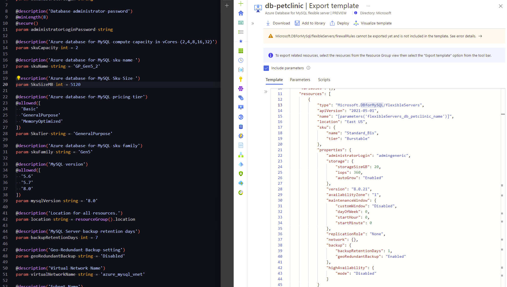

# Spring PetClinic on Azure Container Apps.

This repo shows the design process and steps necessary to host the Spring PetClinic application on Azure Container Apps. The repo includes the final bicep iac need to create the entire environment.

## Research Process

## Understand the components

Container apps are aimed at hosting http based micro-services. As soon as you deviate away from http, you're not going to get a lot of love from container apps.

If i review what PetClinic micro-services creates (though my [AKS implementation of PetClinic](https://github.com/Gordonby/aksc-petclinic#the-kubernetes-application)), we can see how viable it is to host in container apps.

Component | Protocol | Port | Description
--------- | -------- | ---- | -----------
Api Gateway | HTTP (TCP) | 80 | Externally exposed IP
Customer Service | HTTP (TCP) | 8080 |
Vets Service | | |
Visits Service | | |
Customers Db | | | 
Vets Db | | | 
Visits Db | | | 
Wavefront proxy | | |

The databases are obviously going to be a problem here.

If we expand one of the services we can see the container takes 3 environment variables for the database
- SPRING_DATASOURCE_URL (value: jdbc:mysql://vets-db-mysql.spring-petclinic.svc.cluster.local:3306/service_instance_db?queryInterceptors=brave.mysql8.TracingQueryInterceptor&exceptionInterceptors=brave.mysql8.)TracingExceptionInterceptor&zipkinServiceName=vets-db
- SPRING_DATASOURCE_USERNAME (value: root)
- SPRING_DATASOURCE_PASSWORD

We can look to leverage the hosted Azure MySql database service for the databases, and at this point it's worth scanning GitHub to see what else people have done with the application on Azure to see if we have some reusable content to speed things up.

Apart from this, i don't see any blockers to Container Apps being able to host the workload.

## Other samples

The most obvious existing sample is [azure-samples/spring-petclinic-microservices](https://github.com/azure-samples/spring-petclinic-microservices) which is focussed on the Azure Spring Cloud service.
The sample does however [create MySql databases](https://github.com/azure-samples/spring-petclinic-microservices#create-mysql-database) (albeit using the AzureCLI, not ARM).
I don't think this is going to be super helpful, but at least there's a repo to refer to if i have problems connecting to my MySql database(s).

## Stage 1 - Create the MySql database

I'm not massively familiar with MySQL, so i'll start with 4 routes

- Create a MySQL database service in the portal, looking for highlighted/default options
- Look for a [Microsoft learn module](https://docs.microsoft.com/en-us/learn/modules/intro-to-azure-database-for-mysql/) to skim for key design decisions
- Look at the pricing for the service to properly architect for cost
- Look at the documentation

### Design decisions

Source | Summary | Description | Thoughts
------ | ------- | ----------- | --------
Portal | Flexible Server or Single Server | Flexible is recommended by the portal. | The main reason to go single server seems to be for the private-link support. I'll likely support both models in the bicep, depending on how the RP works.
Portal | Cost | Basic feature selection can wildy vary the price of the service | The most basic server configuration on a B1s instance costs ~$8.61/month. I'll start with this. 
Portal | Networking | Placing in a vnet is available for the most basic flexible server. | I'll need to dive into the value prop of the single server much more once i have something up and running.
Portal | Firewall | Enabling Azure services to communicate with the database is provided as a checkbox | I'll need to check that ContainerApps is in the list of supported Azure services.
Docs | [MySql in a Vnet](https://docs.microsoft.com/azure/mysql/flexible-server/concepts-networking) | Review [unsupported networking scenarios](https://docs.microsoft.com/en-us/azure/mysql/flexible-server/concepts-networking#unsupported-virtual-network-scenarios) | Subnet size (address spaces) cannot be increased after allocation.
Docs | Subnet sizing | A /28 feels like a good default | Recommendation is to reserve at least 2 IP address per flexible server keeping in mind that we can enable high availability options later. 
Docs | Private Access | Flexible Server integrates with Azure Private DNS zones to provide a reliable, secure DNS service | I'm going to need to deploy private dns with the service
## Cutting the bicep

Checking the CARML IaC library shows that this is not a service that's been added yet.
There is one bicep template in the [Azure Quickstart Templates](https://github.com/Azure/azure-quickstart-templates/tree/master/quickstarts/microsoft.dbformysql) repo, so i'll use that as the base.

I'll now compare the default/allowed values from the bicep code to the database i created in the Azure Portal.

I can see a few key differences and points i'll want to address in my bicep

- It's using a different RP, `servers@2017-12-01` not `flexibleServers@2021-05-01`
- SKU Name is hardcoded
- My burstable SKU Tier is not in allowed in the parameter array
- Administrator login & password are passed as a parameters
- It leverages a virtual network

###

## Stage 2 - Creating the Container Apps

## Stage 3 - Adding telemetry
## Stage 4 - Making it private & secure

### Virtual Networks

### Frontdoor for ingress

### Secret storage

### Database authentication

## Stage 5 - Scale

### Configure for scaling

### Load tests